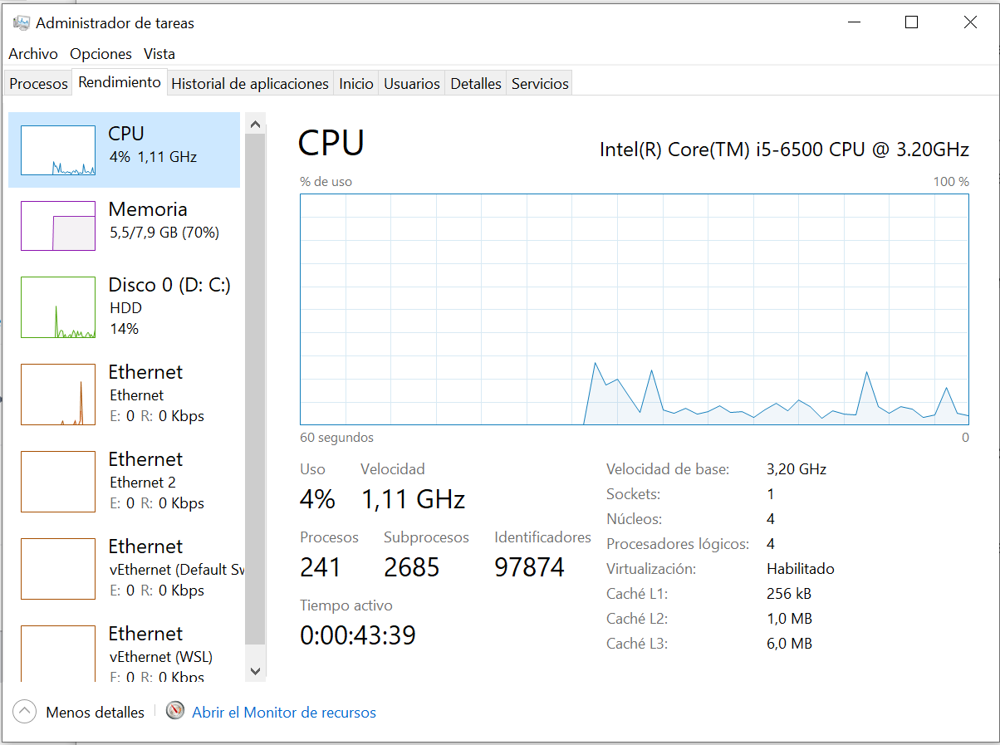
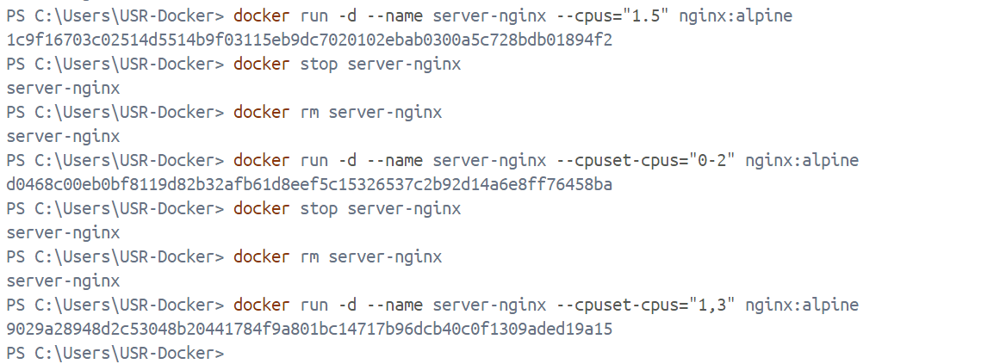

# Limitar uso de procesador
Limitar la cantidad de núcleos de CPU:
```
--cpus=<número de núcleos>
```

Asignar núcleos de CPU específicos:
```
--cpuset-cpus=<lista de núcleos>
```

**¿Como saber el numero de procesadores virtuales que tiene una máquina?**
Para saber el número de procesadores virtuales en mi máquina con Windows, abro el Administrador de tareas haciendo clic derecho en la barra de tareas y seleccionando la opción correspondiente, o simplemente presionando Ctrl + Shift + Esc. Luego, voy a la pestaña Rendimiento y selecciono CPU en el panel izquierdo. Ahí, puedo ver el número de núcleos físicos y procesadores lógicos (virtuales) disponibles en mi computadora, que corresponden a los hilos de cada núcleo.



## Ejemplos
_Puedes copiar y ejecutar directamente cada uno de los comandos_

Limitar el uso de CPU a 1.5 núcleos
```
docker run -d --name server-nginx --cpus="1.5" nginx:alpine
```

Restringir el contenedor para que use los núcleos de CPU 0 a 2:
```
docker run -d --name server-nginx --cpuset-cpus="0-2" nginx:alpine
```

Restringir el contenedor para que use los núcleos de CPU 1 y 3:
```
docker run -d --name server-nginx --cpuset-cpus="1,3" nginx:alpine
```


